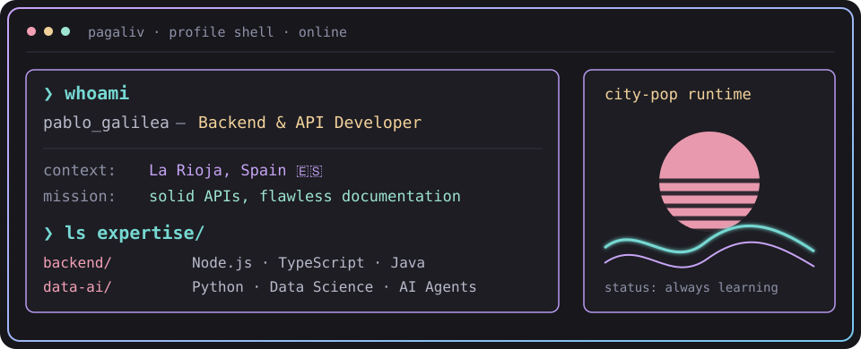

<!-- CITY-POP BANNER -->
<a href="https://github.com/pagaliv">
  <picture>
    <source media="(prefers-color-scheme: dark)" srcset="assets/banner-dark.v9.svg">
    <source media="(prefers-color-scheme: light)" srcset="assets/banner-light.v9.svg">
    
  </picture>
</a>

  

&nbsp;&nbsp;

---

## 🇪🇸 Versión en español

[saltar a la versión en inglés ↓](#en)

 

  

### `$ whoami`

  

 

### `$ cat tech-stack.yaml`

<table border="1" cellpadding="14" bgcolor="#17171c">
  <thead>
    <tr>
      <th colspan="2" align="left"><code>pagaliv:~$ cat tech-stack.yaml</code></th>
    </tr>
  </thead>
  <tbody>
    <tr>
      <td width="50%" valign="top"><code>├─ ✦ lenguajes:</code>  
         
        <code>Node.js · TypeScript · JavaScript · Java · C · C++</code>
      </td>
      <td width="50%" valign="top"><code>├─ ▣ bases_de_datos:</code>  
         
        <code>PostgreSQL · MySQL · SQL</code>
      </td>
    </tr>
    <tr>
      <td valign="top"><code>├─ ⚙ contenedores_y_control_versiones:</code>  
         
        <code>Docker · Kubernetes · Git</code>
      </td>
      <td valign="top"><code>├─ ◉ documentacion:</code>  
         
        <code>LaTeX · Doxygen · Markdown · Google Apps Script</code>
      </td>
    </tr>
    <tr>
      <td colspan="2" valign="top"><code>╰─ ⌁ explorando:</code>  
         
        <code>Qiskit · Computación cuántica · Ciencia de datos · Agentes de IA</code>
      </td>
    </tr>
  </tbody>
  <tfoot>
    <tr>
      <td colspan="2"><code>status: terminando_grado&nbsp;&nbsp;·&nbsp;&nbsp;environment: TFG</code></td>
    </tr>
  </tfoot>
</table>

---

### `$ cat skills-radar.log`

  <picture>
    <source media="(prefers-color-scheme: dark)" srcset="assets/radar-dark.svg">
    <source media="(prefers-color-scheme: light)" srcset="assets/radar-light.svg">
    
  </picture>

<code>signals: backend_skill_radar · self_rated · status: healthy</code>

---

### `$ ls proyectos/ --destacados`

**🧾 Billing API — TFG**
> API REST para gestión de facturación. Diseñada con principios de arquitectura limpia, documentada con Doxygen y memoria técnica en LaTeX. Memoria publicada en mi perfil para mayor información.

`REST API` `Backend` `LaTeX`

 

**🎉 Servidor de cumpleaños**
> Aplicación web completa para gestionar un evento personal: invitados, confirmaciones y organización. Construida con Google Apps Script como backend y HTML/CSS/JS en el frontend. Aún en privado para que mis amigos no tengan info aún.

`Google Apps Script` `JavaScript` `HTML/CSS` `Web App`

---

### `$ git log --stats`

---

### `$ connect --contacto`

&nbsp;&nbsp;
&nbsp;&nbsp;

 

<a href="#en">🇬🇧 Switch to English ↑</a>

---

## 🇬🇧 English version

[jump to the Spanish version ↓](#es)

 

  

### `$ whoami`

  

 

### `$ cat tech-stack.yaml`

<table border="1" cellpadding="14" bgcolor="#17171c">
  <thead>
    <tr>
      <th colspan="2" align="left"><code>pagaliv:~$ cat tech-stack.yaml</code></th>
    </tr>
  </thead>
  <tbody>
    <tr>
      <td width="50%" valign="top"><code>├─ ✦ languages:</code>  
         
        <code>Node.js · TypeScript · JavaScript · Java · C · C++</code>
      </td>
      <td width="50%" valign="top"><code>├─ ▣ databases:</code>  
         
        <code>PostgreSQL · MySQL · SQL</code>
      </td>
    </tr>
    <tr>
      <td valign="top"><code>├─ ⚙ containers_and_versioning:</code>  
         
        <code>Docker · Kubernetes · Git</code>
      </td>
      <td valign="top"><code>├─ ◉ documentation:</code>  
         
        <code>LaTeX · Doxygen · Markdown · Google Apps Script</code>
      </td>
    </tr>
    <tr>
      <td colspan="2" valign="top"><code>╰─ ⌁ exploring:</code>  
         
        <code>Qiskit · Quantum computing · Data science · AI agents</code>
      </td>
    </tr>
  </tbody>
  <tfoot>
    <tr>
      <td colspan="2"><code>status: finishing_degree&nbsp;&nbsp;·&nbsp;&nbsp;environment: thesis</code></td>
    </tr>
  </tfoot>
</table>

---

### `$ cat skills-radar.log`

  <picture>
    <source media="(prefers-color-scheme: dark)" srcset="assets/radar-dark.svg">
    <source media="(prefers-color-scheme: light)" srcset="assets/radar-light.svg">
    
  </picture>

<code>signals: backend_skill_radar · self_rated · status: healthy</code>

axis labels are in Spanish (self-rated source data)

---

### `$ ls projects/ --featured`

**🧾 Billing API — Thesis (TFG)**
> REST API for invoice and billing management. Designed with clean architecture principles, documented with Doxygen and a full technical report in LaTeX. The report is published on my profile for more details.

`REST API` `Backend` `LaTeX`

 

**🎉 Birthday event server**
> Full web app to manage a personal event: guests, RSVPs and logistics. Built with Google Apps Script as the backend and HTML/CSS/JS on the frontend. Still private so my friends don't get spoiled.

`Google Apps Script` `JavaScript` `HTML/CSS` `Web App`

---

### `$ git log --stats`

---

### `$ connect --contact`

&nbsp;&nbsp;
&nbsp;&nbsp;

 

<a href="#es">🇪🇸 Cambiar a español ↑</a>

---

Hecho con 💖 desde La Rioja, España · @pagaliv

